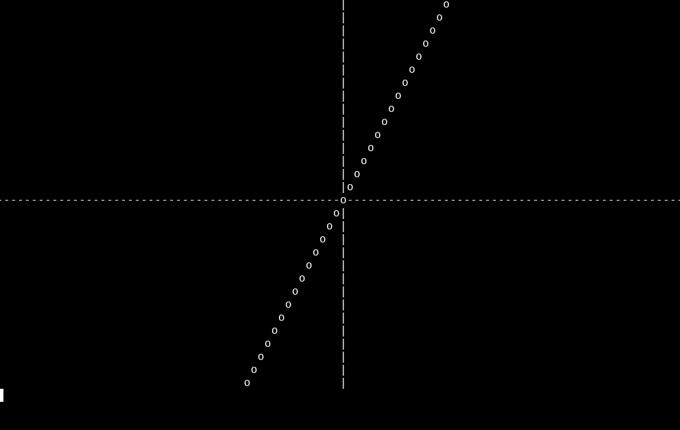
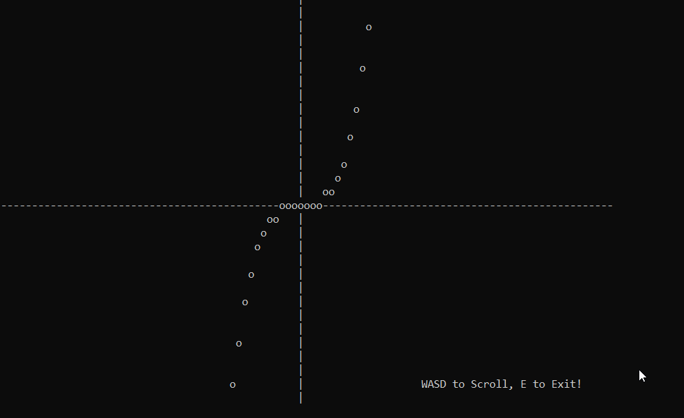

ASCII-Graphing Calculator is a simple program which allows a user to draw the graph of an input function using STDIO's prinf() function. The window which contains that graph can be navigated using the WASD keys.

